# PB-5세대 비교검증 사용 설명서

PB(기존 C / Pro\*C) 소스와 PB5(이관된 Java / MyBatis) 소스를 **좌우로 나란히 놓고 줄 단위로 의견을 주고받으며** 이관 정합성을 검증하는 도구입니다.

> 이 문서의 화면은 목(mock) 데이터와 샘플 소스로 촬영했습니다. 실제 화면의 프로그램명·내용은 다릅니다.

---

## 목차

1. [전체 구조 한눈에 보기](#1-전체-구조-한눈에-보기)
2. [시작하기 — 반드시 먼저 할 3가지](#2-시작하기--반드시-먼저-할-3가지)
   - [2.1 즐겨찾기로 자주 보는 프로그램 모으기](#21-즐겨찾기로-자주-보는-프로그램-모으기)
   - [2.2 권장 작업 흐름](#22-권장-작업-흐름)
3. [소스 비교 탭](#3-소스-비교-탭)
   - [3.1 코드 패널 조작](#31-코드-패널-조작)
   - [3.2 메서드 접기 / 펴기](#32-메서드-접기--펴기)
   - [3.3 코드 내용 검색 (Ctrl+F)](#33-코드-내용-검색-ctrlf)
   - [3.4 의견(댓글) 남기기](#34-의견댓글-남기기)
   - [3.5 스레드 읽기 · 답글 · 종료](#35-스레드-읽기--답글--종료)
   - [3.6 SQL 대응 보기](#36-sql-대응-보기)
   - [3.7 체크리스트 패널](#37-체크리스트-패널)
4. [의견 모아보기 탭](#4-의견-모아보기-탭)
5. [체크리스트 모아보기 탭](#5-체크리스트-모아보기-탭)
6. [알아두면 좋은 규칙](#6-알아두면-좋은-규칙)
7. [문제 해결(FAQ)](#7-문제-해결faq)
8. [부록 — 실행 방법](#8-부록--실행-방법)

---

## 1. 전체 구조 한눈에 보기

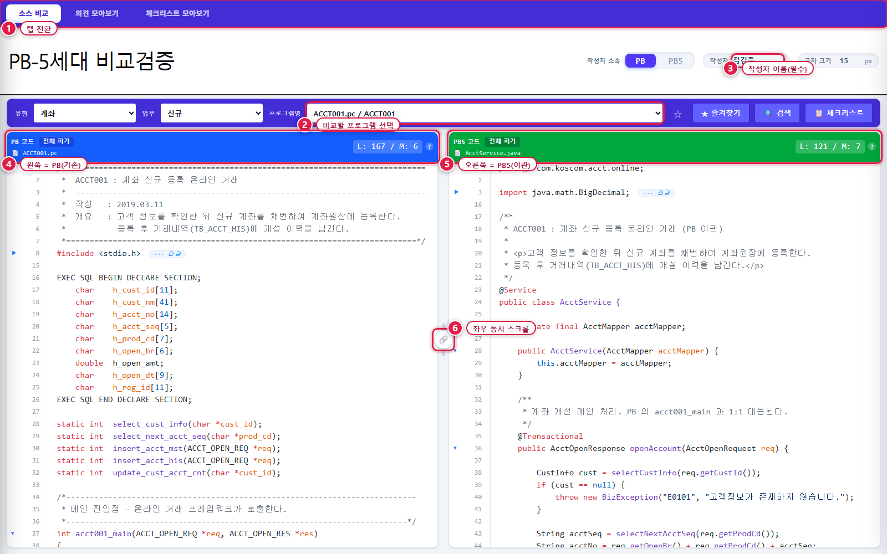

| 번호 | 위치 | 설명 |
|:---:|---|---|
| **1** | 상단 탭 | **소스 비교** / **의견 모아보기** / **체크리스트 모아보기** 3개 탭. 탭을 옮겨도 각 화면 상태는 그대로 유지됩니다. |
| **2** | 프로그램명 | 비교할 프로그램을 고르면 좌·우 소스가 함께 로드됩니다. |
| **3** | 작성자 | 의견을 쓰려면 **이름이 반드시 필요**합니다. 비어 있으면 입력칸이 빨갛게 표시됩니다. |
| **4** | 왼쪽(파란 패널) | **PB = 기존 C / Pro\*C 소스** |
| **5** | 오른쪽(초록 패널) | **PB5 = 이관된 Java / XML 소스** |
| **6** | 가운데 🔗 | **동기 스크롤** — 켜면 좌우가 같이 스크롤됩니다(단축키 `Alt+S`). |

세 탭의 역할은 다음과 같습니다.

| 탭 | 무엇을 하는 곳인가 |
|---|---|
| **소스 비교** | 실제 검증 작업을 하는 곳. 코드를 보고, 그 줄에 의견을 달고, 체크리스트를 채웁니다. |
| **의견 모아보기** | 여러 프로그램의 의견(스레드)을 모아 보고 답글·처리완료를 진행합니다. |
| **체크리스트 모아보기** | 프로그램 × 점검 문항 매트릭스로 전체 진행 상황을 조망합니다. |

---

## 2. 시작하기 — 반드시 먼저 할 3가지

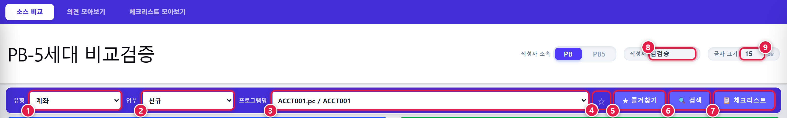

| 번호 | 항목 | 설명 |
|:---:|---|---|
| **1** | **유형** | 대분류(예: 계좌, 회원)를 먼저 선택합니다. |
| **2** | **업무** | 중분류(예: 신규, 이체, 인증). 유형을 고르기 전에는 비활성입니다. |
| **3** | **프로그램명** | `PB소스파일명 / 프로그램ID` 형태로 표시됩니다. 선택하는 순간 좌·우 소스가 로드됩니다. |
| **4** | **☆ / ★** | 지금 보고 있는 프로그램을 즐겨찾기에 넣고 뺍니다. |
| **5** | **★ 즐겨찾기** | 즐겨찾기한 프로그램을 칩으로 펼쳐 한 번에 열 수 있습니다. |
| **6** | **🔍 검색** | 코드 내용 검색 바를 열고 닫습니다(`Ctrl+F`). |
| **7** | **📋 체크리스트** | 왼쪽에서 슬라이드로 열리는 점검 체크리스트 패널. |
| **8** | **작성자 소속 · 작성자** | `PB` / `PB5` 중 **내 소속**을 고르고, **이름**을 입력합니다. |
| **9** | **글자 크기** | 코드 폰트 크기(px). 최소 14px. |

> ⚠️ **작성자 소속과 이름은 의견 작성의 전제 조건입니다.**
> 이름이 비어 있으면 의견을 전송할 때 "작성자 이름을 먼저 입력해주세요" 오류가 납니다.
> 소속(PB/PB5)은 스레드의 다음 차례와 조치구분 권한을 결정하므로 **본인 소속을 정확히** 고르세요.

**순서 정리**

```
① 작성자 소속(PB / PB5) 선택  →  ② 작성자 이름 입력  →  ③ 유형 → 업무 → 프로그램명 선택
```

### 2.1 즐겨찾기로 자주 보는 프로그램 모으기

검증 중인 프로그램이 여러 개일 때, 매번 3단 선택을 반복하지 않고 한 번에 전환할 수 있습니다.

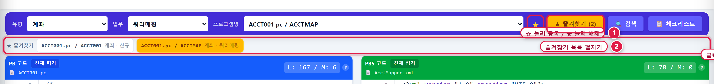

| 번호 | 항목 | 설명 |
|:---:|---|---|
| **1** | **☆ / ★** | 지금 열려 있는 프로그램을 즐겨찾기에 등록(☆) / 해제(★) |
| **2** | **★ 즐겨찾기 (n)** | 즐겨찾기 목록을 칩으로 펼치고 접습니다. 괄호 안 숫자가 등록 개수 |
| **3** | **칩 목록** | 클릭하면 그 프로그램으로 바로 전환됩니다. 지금 보고 있는 프로그램은 노란색으로 표시 |

- 즐겨찾기는 **의견 모아보기 탭의 `★ 즐겨찾기 모아보기`** 와 연동됩니다 — 등록해 둔 프로그램들의 의견만 한 번에 볼 수 있습니다.
- 저장 위치는 브라우저(`localStorage`)입니다. **PC·브라우저를 바꾸면 목록도 달라집니다.**

### 2.2 권장 작업 흐름

처음 쓰는 경우 아래 순서를 그대로 따라가면 됩니다.

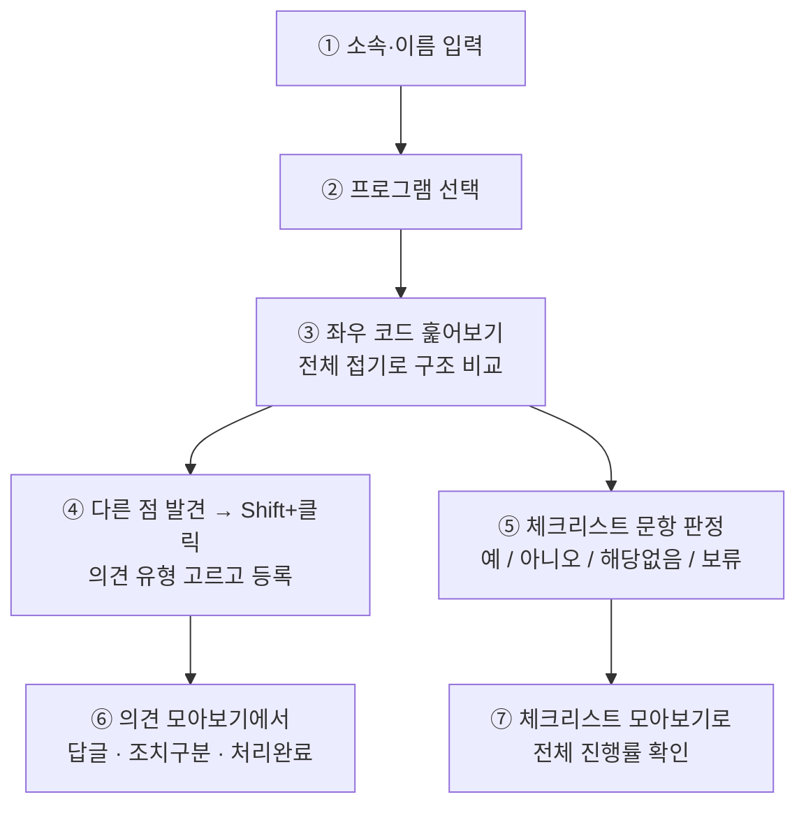
```mermaid
flowchart TD
    A["① 소속·이름 입력"] --> B["② 프로그램 선택"]
    B --> C["③ 좌우 코드 훑어보기<br/>전체 접기로 구조 비교"]
    C --> D["④ 다른 점 발견 → Shift+클릭<br/>의견 유형 고르고 등록"]
    C --> E["⑤ 체크리스트 문항 판정<br/>예 / 아니오 / 해당없음 / 보류"]
    D --> F["⑥ 의견 모아보기에서<br/>답글 · 조치구분 · 처리완료"]
    E --> G["⑦ 체크리스트 모아보기로<br/>전체 진행률 확인"]
```

| 단계 | 어디서 | 무엇을 |
|:---:|---|---|
| ① | 소스 비교 탭 상단 | 작성자 소속(PB/PB5)·이름 입력 |
| ② | 선택바 | 유형 → 업무 → 프로그램명 |
| ③ | 코드 패널 | `전체 접기`로 함수 구성부터 비교 → 필요한 곳만 펼쳐 정독 |
| ④ | 코드 줄 | **Shift+클릭** → 의견 유형 선택 → 내용 작성 |
| ⑤ | 📋 체크리스트 | 문항별 판정 + 메모 |
| ⑥ | 의견 모아보기 | 상대가 남긴 의견에 답글, 조치구분 표시, 끝나면 처리완료 |
| ⑦ | 체크리스트 모아보기 | 프로그램별 진행률·미판정 항목 확인 |

---

## 3. 소스 비교 탭

### 3.1 코드 패널 조작

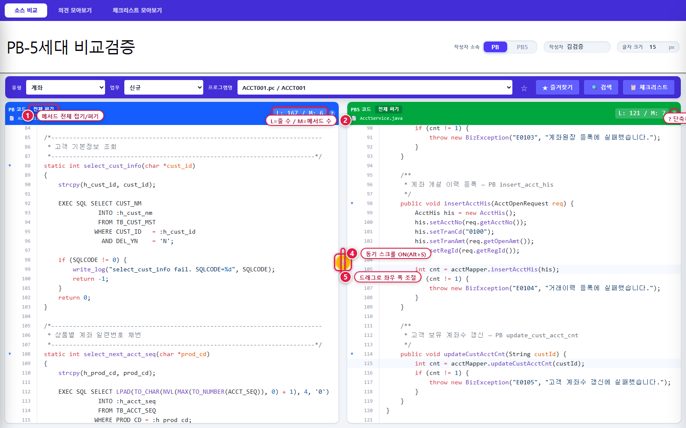

| 번호 | 항목 | 설명 |
|:---:|---|---|
| **1** | **전체 접기 / 전체 펴기** | 그 패널의 모든 메서드를 한 번에 접거나 펼칩니다. |
| **2** | **L / M** | `L` = 전체 줄 수, `M` = 인식된 메서드(함수) 수. 좌우 숫자를 비교해 규모 차이를 빠르게 확인합니다. |
| **3** | **?** | 조작 단축키 도움말을 펼칩니다(좌·우 패널 공유). |
| **4** | **🔗 동기 스크롤** | 노란색이면 켜진 상태. 한쪽을 스크롤하면 반대쪽도 같이 움직입니다(`Alt+S`). |
| **5** | **분할선** | 드래그해서 좌우 패널 너비를 조절합니다. |

**마우스·키보드 조작**

| 조작 | 동작 |
|---|---|
| 메서드 줄 **클릭** | 그 메서드 접기 / 펴기 |
| **Alt + 클릭** | 반대편 소스의 **대응 메서드로 점프** (찾지 못하면 안내 메시지) |
| **Shift + 클릭** | 그 줄에 **새 의견(스레드) 작성** |
| 매퍼 호출 줄 **클릭** (PB5/Java) | **대응 SQL 보기** — 연한 남색 배경으로 표시된 줄 |
| `Ctrl + F` | 코드 내용 검색 열기 |
| `Alt + S` | 동기 스크롤 켜기 / 끄기 |

**줄 왼쪽 마커(●)의 의미**

| 마커 | 의미 |
|---|---|
| 🟣 남색 점 | 미해결 — **PB 담당자 확인 필요** |
| 🟢 초록 점 | 미해결 — **PB5 담당자 확인 필요** |
| ⚪ 회색 점 | **처리완료**된 스레드 |
| 점 + 숫자 | 그 줄에 스레드가 여러 건 → 클릭하면 목록에서 골라 엽니다 |

---

### 3.2 메서드 접기 / 펴기

메서드를 모두 접으면 **구조만 남아** 좌우 함수 구성을 비교하기 쉽습니다. 접힌 줄에는 `··· 접힘` 표시가 붙고 줄 번호가 건너뜁니다(아래 그림에서 `36 → 56`, `60 → 63`).

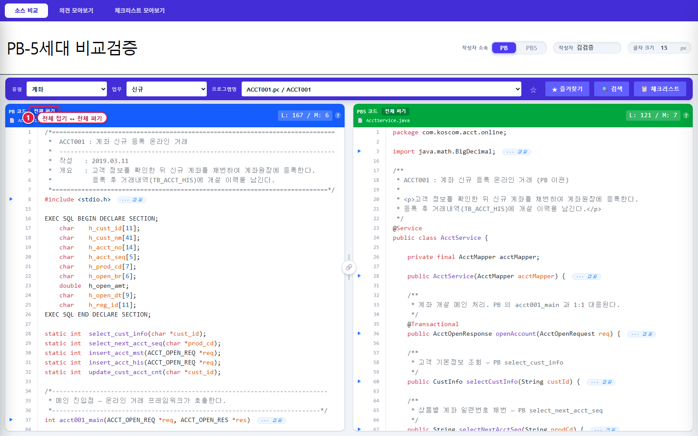

> `import` 블록은 처음 로드할 때 자동으로 접혀 있습니다.

---

### 3.3 코드 내용 검색 (Ctrl+F)

PB와 PB5는 네이밍 규칙이 달라 **좌·우를 각각 따로** 검색합니다.

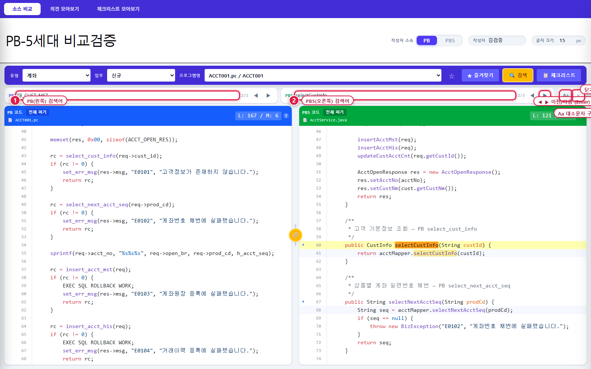

| 번호 | 항목 | 설명 |
|:---:|---|---|
| **1** | PB 검색어 | 왼쪽(PB) 패널에서 찾을 문자열 |
| **2** | PB5 검색어 | 오른쪽(PB5) 패널에서 찾을 문자열 |
| **3** | ◀ ▶ | 이전 / 다음 매치. `Enter` = 다음, `Shift+Enter` = 이전. 옆의 `1/3`은 현재 위치/전체 건수 |
| **4** | **Aa** | 대소문자 구분 켜기/끄기(좌우 공통) |
| **5** | **×** | 검색 닫기(`Esc`) |

> 활용 예: 왼쪽에 테이블명 `TB_CUST_MST`, 오른쪽에 매퍼 메서드 `selectCustInfo`를 넣으면 같은 로직의 짝을 바로 마주 볼 수 있습니다.

---

### 3.4 의견(댓글) 남기기

의견을 달 줄에서 **Shift + 클릭** 하면 입력창이 열립니다.

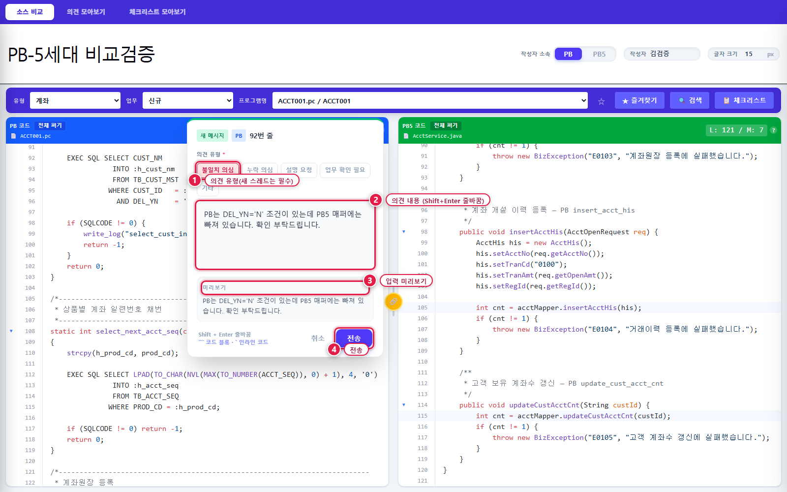

| 번호 | 항목 | 설명 |
|:---:|---|---|
| **1** | **의견 유형** | 새 스레드는 **필수 선택**(답글에는 유형이 없습니다) |
| **2** | **내용** | `Enter` 전송 / `Shift+Enter` 줄바꿈. ` ``` `로 코드 블록, `` ` ``로 인라인 코드 |
| **3** | **미리보기** | 코드 블록이 어떻게 보일지 즉시 확인 |
| **4** | **전송** | 저장. 유형 미선택·이름 미입력이면 막힙니다 |

**의견 유형 5가지**

| 유형 | 언제 쓰는가 |
|---|---|
| **불일치 의심** | Java 로직이 C와 다르게 변환된 것으로 보임 |
| **누락 의심** | 특정 로직·조건·SQL·메시지 등이 빠진 것 같음 |
| **설명 요청** | 왜 이렇게 변환했는지 부연 설명이 필요함 |
| **업무 확인 필요** | 소스만으로는 판단이 어려움 |
| **기타** | 위에 해당하지 않는 의견 |

> 입력창 제목을 잡고 **드래그**하면 창을 옮길 수 있습니다(가리는 코드를 확인할 때 유용).

---

### 3.5 스레드 읽기 · 답글 · 종료

줄 왼쪽 **마커(●)를 클릭**하면 그 줄의 대화가 열립니다.

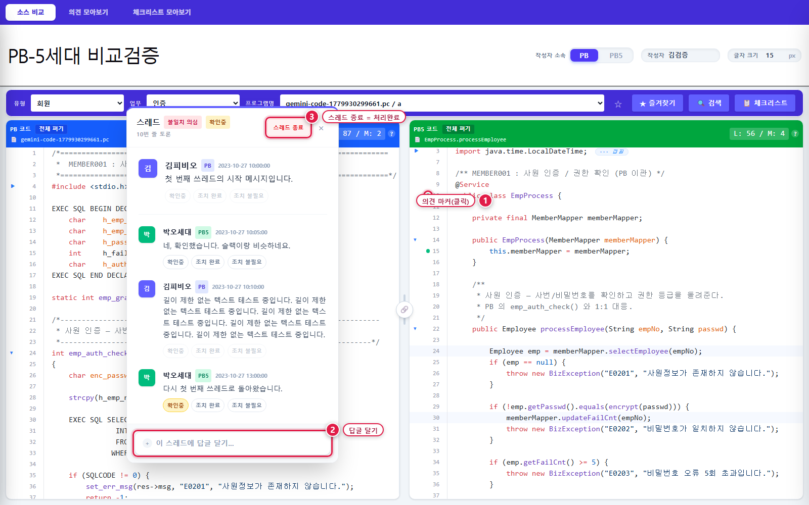

| 번호 | 항목 | 설명 |
|:---:|---|---|
| **1** | **의견 마커** | 클릭해서 스레드를 엽니다. 여러 건이면 목록이 먼저 뜹니다 |
| **2** | **답글 달기** | 이 스레드에 이어서 의견을 답니다 |
| **3** | **스레드 종료** | 처리완료로 닫습니다. 확인 창이 한 번 더 뜹니다 |

**조치구분(확인중 / 조치 완료 / 조치 불필요)**

- 각 **메시지마다** 붙이는 처리 표시입니다.
- **상대 소속이 쓴 글에만** 누를 수 있습니다(본인 측 글에는 비활성).
- 처리완료된 스레드에서는 변경할 수 없고 보기만 됩니다.
- 스레드 목록의 카드에는 **가장 최근 조치구분**이 대표로 표시됩니다.

**스레드 상태 흐름**


```mermaid
flowchart LR
    A["PB가 의견 작성"] --> B["PB5 담당자 확인 필요<br/>(초록 마커)"]
    B --> C["PB5가 답글"]
    C --> D["PB 담당자 확인 필요<br/>(남색 마커)"]
    D --> C
    B --> E["처리완료<br/>(회색 마커)"]
    D --> E
```

> 상태는 **마지막에 글을 쓴 사람의 소속**으로 자동 결정됩니다. PB가 쓰면 다음 차례는 PB5, PB5가 쓰면 다음 차례는 PB입니다. 직접 상태를 고르는 UI는 없습니다.

**한 줄에 의견이 여러 건일 때**

같은 줄에 스레드가 2건 이상이면 마커 옆에 **개수**가 표시되고, 클릭하면 목록이 먼저 뜹니다. 원하는 항목을 고르면 그 스레드가 열립니다.

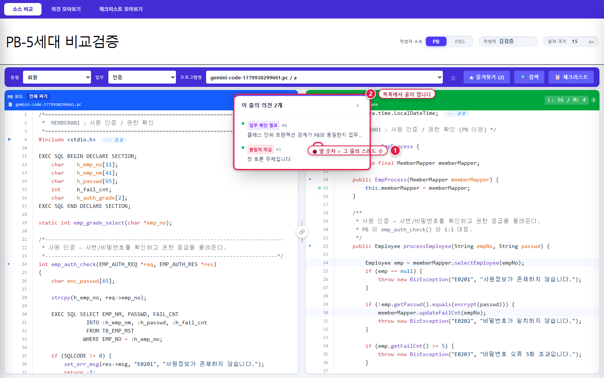

| 번호 | 항목 | 설명 |
|:---:|---|---|
| **1** | **● + 숫자** | 그 줄에 달린 스레드 수 |
| **2** | **선택 목록** | 의견 유형 배지 · 스레드 번호 · 첫 줄 내용으로 구분해 고릅니다 |

---

### 3.6 SQL 대응 보기

PB5(Java) 패널에서 **매퍼 호출 줄**(연한 남색 배경)을 클릭하면, 그 호출에 대응하는 **PB의 인라인 `EXEC SQL`** 과 **PB5 매퍼 XML 구문**을 한 카드에서 비교할 수 있습니다.

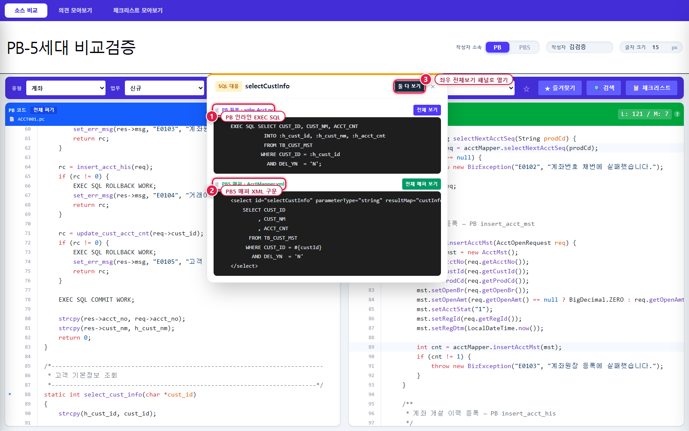

| 번호 | 항목 | 설명 |
|:---:|---|---|
| **1** | **PB 원본** | PB `.pc` 파일에서 찾은 `EXEC SQL` 블록 |
| **2** | **PB5 매퍼** | 매퍼 XML의 해당 `id` 구문 |
| **3** | **둘 다 보기** | 좌우 전체보기 패널로 두 파일 전체를 나란히 엽니다 |

- **전체 보기 / 전체 매퍼 보기**: 한쪽 파일만 전체로 열 때 사용합니다.
- 대응 후보가 여럿이면 제목에 **`대응 후보 N건`** 배지가 붙습니다(동작(verb)과 테이블이 같은 SQL이 여러 개인 경우).

**전체보기 패널** — `둘 다 보기`를 누르면 좌우에서 슬라이드 패널이 열리고, 각 파일의 **해당 SQL 줄이 노란색으로 강조**된 채 파일 전체를 볼 수 있습니다.

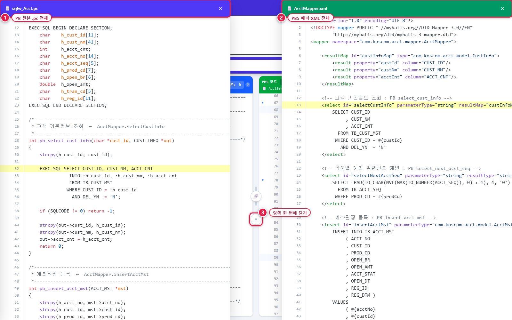

| 번호 | 항목 | 설명 |
|:---:|---|---|
| **1** | 왼쪽 패널 | PB 원본 `.pc` 파일 전체 (대응 `EXEC SQL` 줄 강조) |
| **2** | 오른쪽 패널 | PB5 매퍼 XML 전체 (대응 구문 줄 강조) |
| **3** | 가운데 **×** | 양쪽 패널을 한 번에 닫기 (`Esc` 로도 닫힙니다) |

- 패널 안쪽 가장자리를 드래그하면 패널 폭을 조절할 수 있습니다.
- 각 패널 헤더의 **×** 는 그 패널만 닫습니다.

---

### 3.7 체크리스트 패널

**📋 체크리스트** 버튼을 누르면 왼쪽에서 패널이 열립니다. **선택한 프로그램 단위**로 점검 항목을 기록합니다.

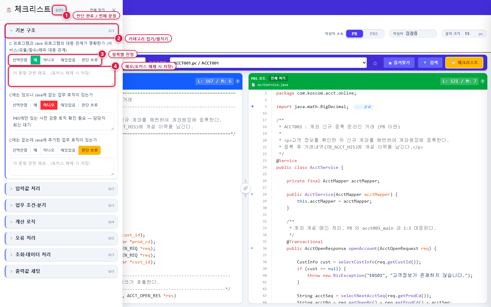

| 번호 | 항목 | 설명 |
|:---:|---|---|
| **1** | **n / 전체** | 판단 완료 문항 수 / 전체 문항 수 |
| **2** | **카테고리** | 클릭하면 그 묶음을 접거나 펼칩니다(제목 옆 숫자도 진행 현황) |
| **3** | **판정 버튼** | `선택안함` `예` `아니오` `해당없음` `판단 보류` 중 하나 |
| **4** | **메모** | 문항별 메모. **입력칸에서 포커스를 빼면 자동 저장**됩니다 |

**판정값의 의미**

| 값 | 색 | 진행률 반영 |
|---|---|:---:|
| **선택안함** | 회색(연함) | ✗ |
| **예** | 초록 | ✔ 판단 완료 |
| **아니오** | 빨강 | ✔ 판단 완료 |
| **해당없음** | 회색 | ✔ 판단 완료 |
| **판단 보류** | 노랑 | ✗ |

> 진행률은 `예 / 아니오 / 해당없음`만 **판단 완료**로 셉니다. `판단 보류`와 `선택안함`은 미판단입니다.

---

## 4. 의견 모아보기 탭

프로그램을 넘나들며 등록된 의견을 모아 봅니다. **탭에 처음 들어가면 전체 의견이 자동으로 조회**됩니다(한 페이지 20건).

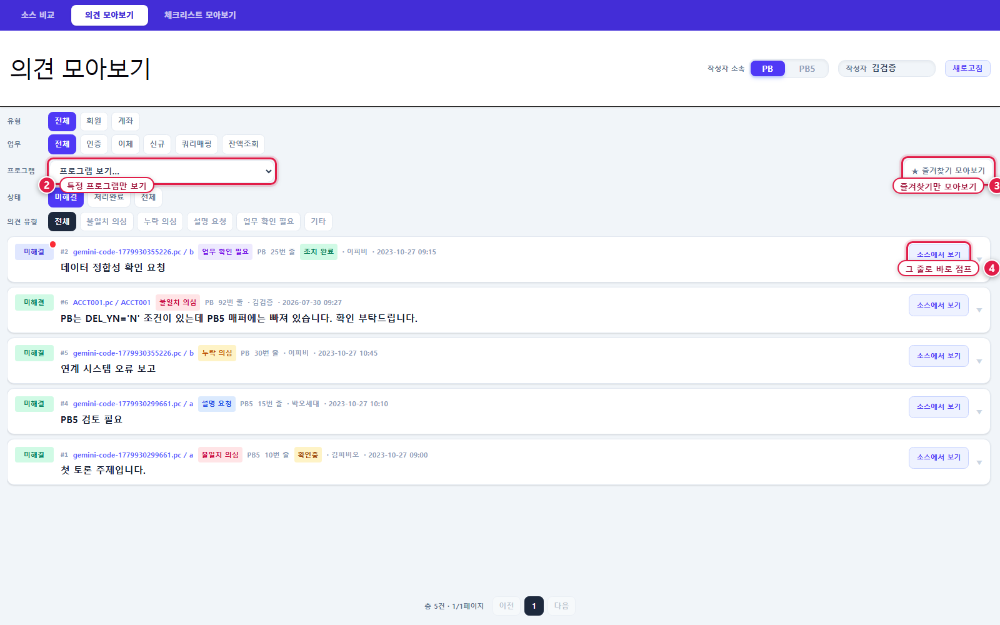

| 번호 | 항목 | 설명 |
|:---:|---|---|
| **1** | **작성자 소속 · 작성자** | 소스 비교 탭과 공유됩니다(답글·조치구분 권한 판단 기준) |
| **2** | **프로그램** | 특정 프로그램의 의견만 봅니다 |
| **3** | **★ 즐겨찾기 모아보기** | 즐겨찾기한 프로그램들의 의견만 모아 봅니다 |
| **4** | **소스에서 보기** | 소스 비교 탭으로 이동해 **그 줄로 바로 점프**합니다 |

**필터 4단**

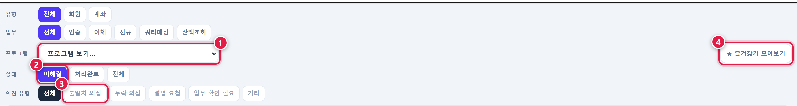

| 번호 | 필터 | 설명 |
|:---:|---|---|
| — | **유형 / 업무** (맨 위 두 줄) | 칩으로 대분류·중분류를 좁힙니다. 둘 다 `전체`면 전체 모아보기 |
| **1** | **프로그램** | 특정 프로그램 하나로 좁힙니다 |
| **2** | **상태** | `미해결`(기본) / `처리완료` / `전체` |
| **3** | **의견 유형** | 불일치 의심·누락 의심·설명 요청·업무 확인 필요·기타 중 하나로 좁힘 |
| **4** | **★ 즐겨찾기 모아보기** | 즐겨찾기한 프로그램들만 |

**카드에 표시되는 정보**

```
[미해결 ●]  #6  ACCT001.pc / ACCT001  [불일치 의심]  PB  92번 줄  [조치 완료]  · 김검증  · 2026-07-30 09:27
            PB는 DEL_YN='N' 조건이 있는데 PB5 매퍼에는 빠져 있습니다.
```

- 왼쪽 배지: **미해결 / 처리완료**
- 배지 오른쪽 위 **빨간 점** = 지금 내 소속이 답해야 하는 **내 차례**
- `#6` 스레드 번호 · 프로그램 · 의견 유형 · 코드 종류(PB/PB5) · 줄 번호 · 마지막 조치구분 · 작성자 · 작성 시각

**카드를 펼치면** 전체 대화가 열립니다.

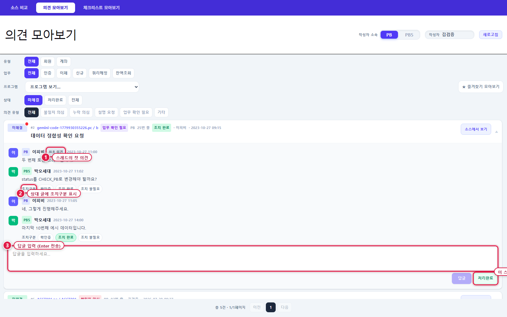

| 번호 | 항목 | 설명 |
|:---:|---|---|
| **1** | **최초 의견** | 스레드를 시작한 첫 글 |
| **2** | **조치구분** | 상대 소속 글에만 표시·설정 가능 |
| **3** | **답글 입력** | `Enter` 전송 / `Shift+Enter` 줄바꿈 |
| **4** | **처리완료** | 이 스레드를 종료합니다 |

**수정 / 삭제 규칙** — 아래를 **모두** 만족할 때만 버튼이 보입니다.

1. 내가 쓴 글 (**작성자 이름 + 소속이 모두 일치**)
2. 스레드가 **미해결** 상태
3. 그 글 **이후에 상대 소속이 답하지 않음**

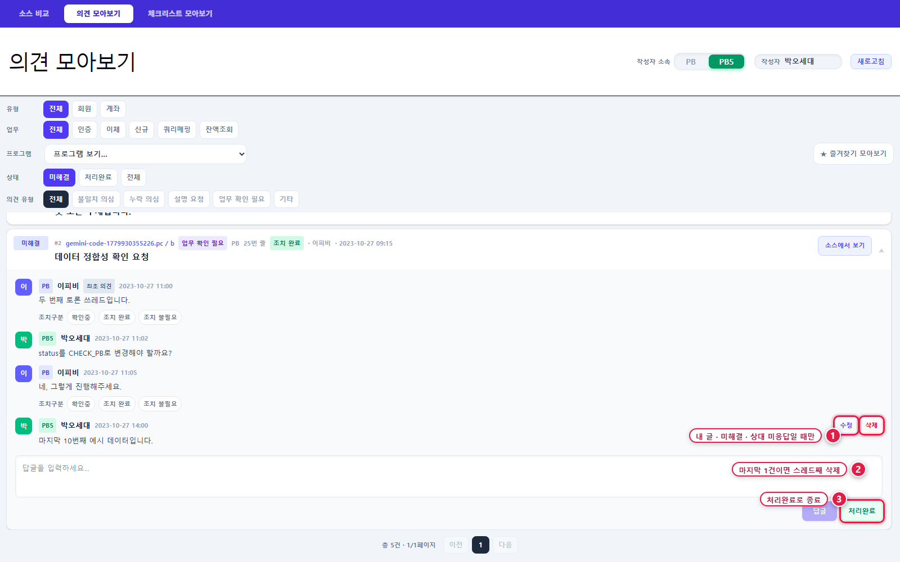

| 번호 | 항목 | 설명 |
|:---:|---|---|
| **1** | **수정** | 내용을 고친 뒤 `저장`(또는 `Enter`) / `취소`. 위 3개 조건을 만족하는 글에만 나타납니다 |
| **2** | **삭제** | 확인 후 삭제. 그 스레드의 **마지막 1건**이면 스레드째 삭제됩니다 |
| **3** | **처리완료** | 이 스레드를 종료합니다 |

> 위 그림은 `작성자 소속 = PB5`, `작성자 = 박오세대` 로 맞춘 상태입니다. **소속이나 이름이 다르면 버튼 자체가 보이지 않습니다** — 남의 글을 고치지 못하게 하는 안전장치입니다.

---

## 5. 체크리스트 모아보기 탭

**행 = 프로그램**, **열 = 점검 문항**인 매트릭스로 전체 진행 상황을 조망합니다. (읽기 전용 — 값 입력은 소스 비교 탭의 체크리스트 패널에서)

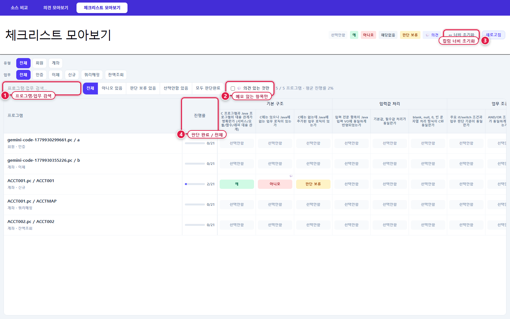

| 번호 | 항목 | 설명 |
|:---:|---|---|
| **1** | **검색** | 프로그램·업무 이름으로 행을 좁힙니다 |
| **2** | **💬 의견 있는 것만** | 메모가 달린 항목이 있는 프로그램만 |
| **3** | **↔ 너비 초기화** | 드래그로 바꾼 컬럼 너비를 기본값으로 되돌립니다 |
| **4** | **진행률** | `판단 완료 / 전체 문항`. 가로 스크롤에도 왼쪽에 고정됩니다 |

- 상단 상태 필터: `전체` / `아니오 있음` / `판단 보류 있음` / `선택안함 있음` / `모두 판단완료`
- 헤더 상단은 **카테고리(제목)**, 아래는 **개별 점검 문항**입니다. 컬럼 경계를 드래그하면 너비가 바뀝니다.
- **프로그램명을 클릭**하면 소스 비교 탭에서 그 프로그램이 열립니다.

**메모 보기** — 메모가 달린 셀에는 오른쪽 위에 **💬** 가 붙습니다. 누르면 그 문항의 판정과 메모를 카드로 보여 줍니다.

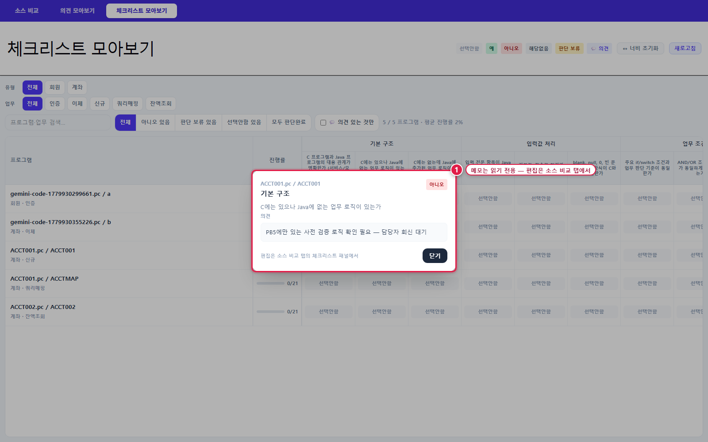

> 이 카드는 **읽기 전용**입니다. 내용을 고치려면 소스 비교 탭에서 그 프로그램을 열고 **📋 체크리스트** 패널에서 수정하세요.

---

## 6. 알아두면 좋은 규칙

| 주제 | 규칙 |
|---|---|
| **스레드 상태** | 직접 바꾸지 않습니다. **마지막 글쓴이의 소속**으로 자동 파생(PB가 쓰면 → PB5 확인 필요). |
| **의견 유형** | 새 스레드에만 필수로 지정하고, 이후 **바뀌지 않습니다**. 답글에는 유형이 없습니다. |
| **조치구분** | 메시지 단위. **상대 측 글에만** 설정 가능하고, 처리완료 스레드에서는 보기 전용. |
| **수정·삭제** | 본인(이름+소속) 글 + 미해결 + 이후 상대가 답하지 않은 경우에만. |
| **처리완료** | 종료하면 더 이상 그 스레드에 글을 남길 수 없습니다(되돌리는 UI 없음 — 종료 전 확인 창이 뜨는 이유). |
| **즐겨찾기·작성자·글자 크기·패널 상태** | 브라우저 `localStorage`에 저장됩니다. **PC·브라우저마다 별도**이며 서버에 공유되지 않습니다. |
| **소스 파일 위치** | `fe/src/assets/code/` 아래에서 **파일명(basename)** 으로 찾습니다. PB는 `c/**/*.pc`, PB5는 `java/**/*.java`·`*.xml`. 폴더 깊이는 상관없습니다. |
| **한글 인코딩** | PB 소스가 EUC-KR(CP949)이면 자동 감지해 복원합니다(PB5는 UTF-8 가정). |

---

## 7. 문제 해결(FAQ)

| 증상 | 원인 / 해결 |
|---|---|
| "소스 코드를 불러오세요"만 보인다 | 프로그램을 아직 선택하지 않았습니다. **유형 → 업무 → 프로그램명** 순으로 고르세요. |
| 프로그램을 골랐는데 한쪽 코드가 비어 있다 | 그 파일명에 해당하는 소스가 `fe/src/assets/code/` 에 없습니다. 파일을 넣고 새로고침하세요. |
| 의견이 전송되지 않는다 | ① **작성자 이름**이 비었는지 ② 새 스레드인데 **의견 유형**을 골랐는지 확인하세요. |
| 조치구분 버튼이 눌리지 않는다 | **본인 측 글**이거나 스레드가 **처리완료** 상태입니다(정상 동작). |
| 수정·삭제 버튼이 안 보인다 | 내 글이 아니거나, 처리완료 스레드이거나, 그 글 뒤에 **상대가 이미 답글**을 달았습니다. |
| SQL 대응에서 "PB 파일(…)을 찾지 못했습니다" | PB SQL 파일명 접두사 설정(`fe/src/config/.env.development` 의 `VITE_PB_SQL_PREFIX`)과 실제 `.pc` 파일명이 맞지 않습니다. |
| Alt+클릭 점프가 안 된다 | 대응 메서드명을 찾지 못했거나(좌우 이름 규칙 상이) 대상이 **접혀 있습니다**. 반대쪽을 펴고 다시 시도하세요. |
| 마커가 보이지 않는다 | 그 줄이 접힌 영역(예: 자동 접힌 `import` 블록) 안에 있을 수 있습니다. 펴고 확인하세요. |

---

## 8. 부록 — 실행 방법

**백엔드** (기본 포트 `50004`)

```bash
npm --prefix be run start
```

**프론트엔드** (기본 포트 `5173`)

```bash
npm --prefix fe run dev
```

- 접속: `http://localhost:5173`
- 백엔드 주소는 `fe` 의 `VITE_API_BASE_URL`(미설정 시 `http://localhost:50004`)로 결정됩니다. 환경변수 파일 위치는 `fe/src/config/` 입니다(`vite.config.ts` 의 `envDir`).
- DB 접속 없이 **목(mock) 데이터**로 띄우려면 `be/src/config/index.ts` 의 구현체를 `StaticAppConfig` 로 둡니다(기본값). 실제 Oracle 로 붙일 때는 같은 파일 한 줄만 교체합니다.

**소스가 화면에 나오게 하려면**

비교 대상 소스는 저장소에 포함돼 있지 않습니다. 아래 위치에 파일명을 맞춰 넣어야 코드가 보입니다.

| 구분 | 위치 | 확장자 |
|---|---|---|
| PB | `fe/src/assets/code/c/**` | `.pc` `.c` `.h` |
| PB5 | `fe/src/assets/code/java/**` | `.java` `.xml` |

> 폴더 깊이는 상관없고 **파일명**으로 찾습니다. 이 설명서의 화면은 `docs/manual/sample-src/` 의 샘플 소스를 위 위치에 복사해 촬영한 것입니다. 화면을 똑같이 재현해 보려면 그대로 복사하면 됩니다.
>
> ```bash
> cp -r docs/manual/sample-src/c/. fe/src/assets/code/c/ && cp -r docs/manual/sample-src/java/. fe/src/assets/code/java/
> ```

---

<div align="right"><sub>최초 작성 2026-07-30 · 최종 갱신 2026-08-05</sub></div>
